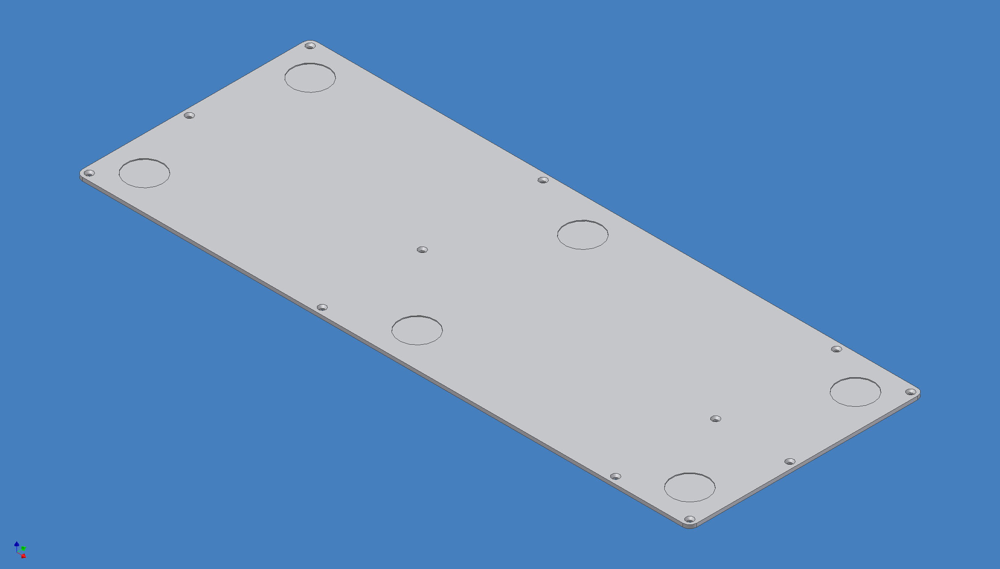
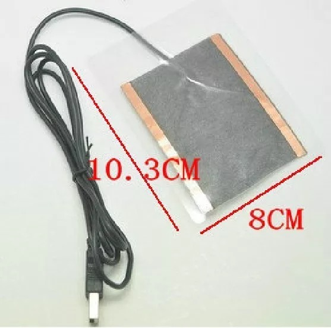
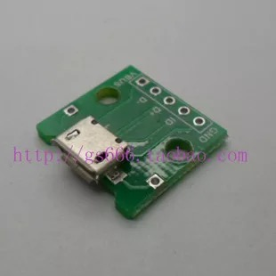
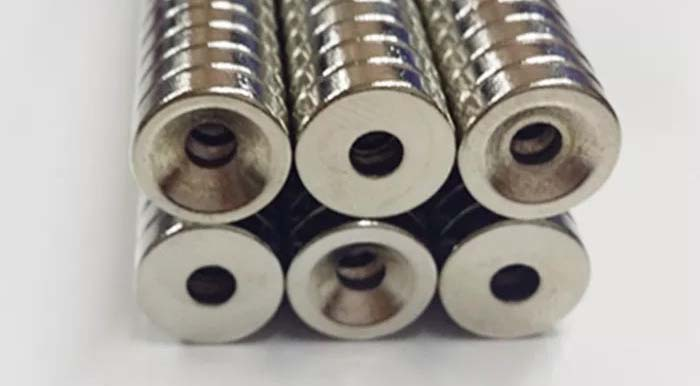
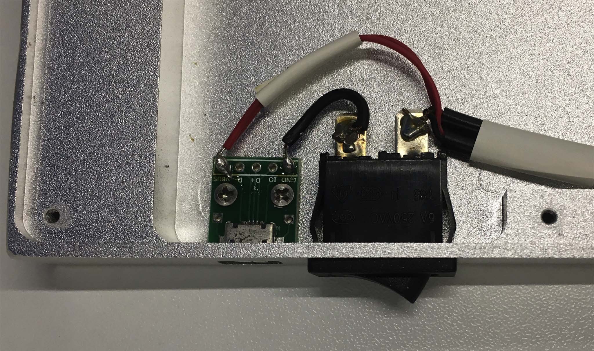
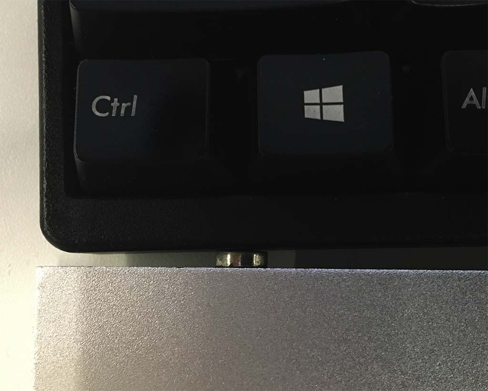
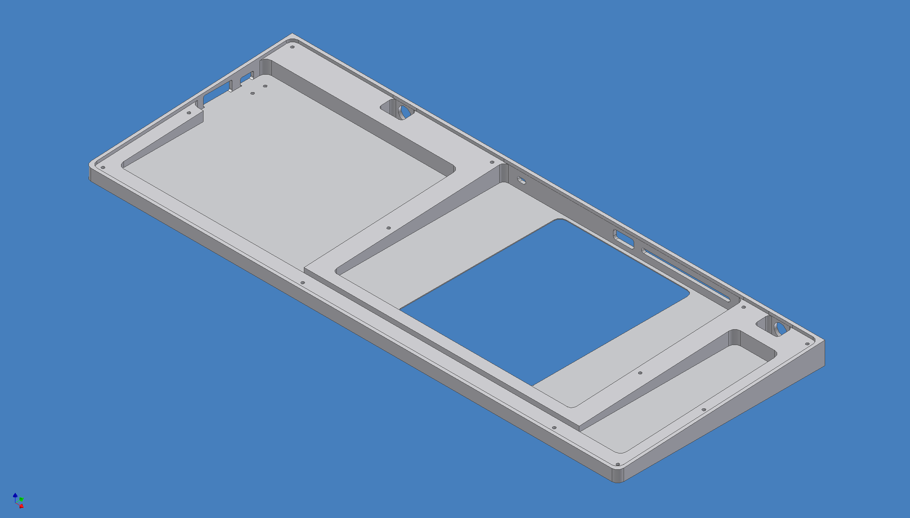
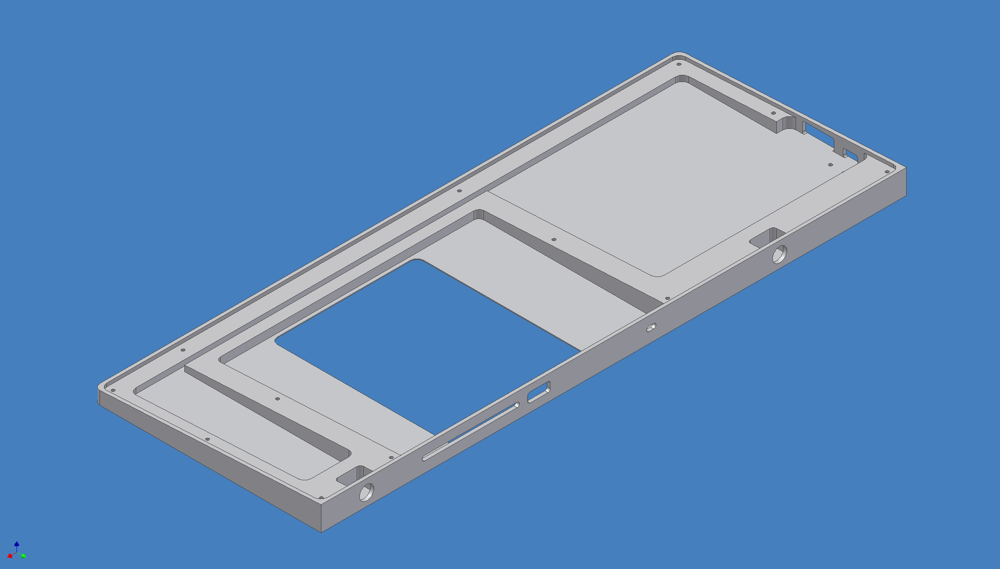
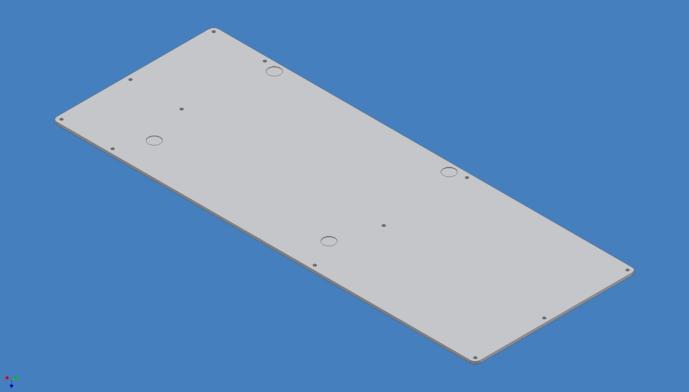
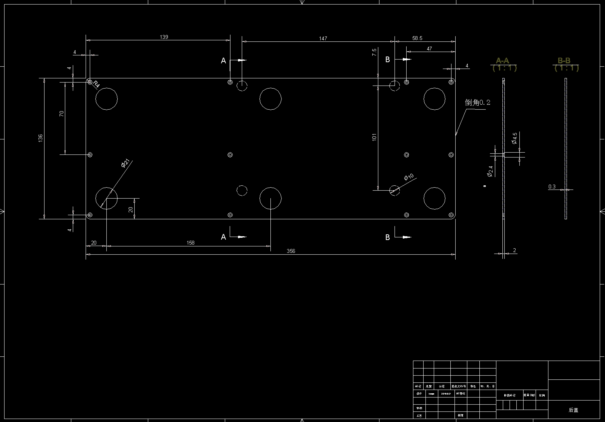

# Handrest designed for Apple Trackpad2

## Summary

[中文版](README_cn.md)

This is my desktop. 

I use Trackpad2 with Filco 87 keyboard, simulating the experience of MacBook's keyboard and trackpad.

The main idea to avoid moving hands from the keyboard.

This project is the design of the handrest.

* made of aluminum 6063
* can be attached to the keyboard with magnets
* will not interfere with typing
* with built-in heating

## Parts

The main parts are the handrest and backcover. 
And we need some other small parts.

### The handrest

### The backcover

### Other parts

* 3 + 3 paste foot pads

* 12 screws - M2x6
* scotch tape

Optional for heating:

* 2 usb heating plate - 100x80

* 1 micro usb socket

* 1 switch - MR-2

* 2 screws - M2x4
* some wires

Optional for attaching to keyboard:

* 2 magnets - 15x10x10

* 2 magnets - D10x3x4

* 2 screws - M4x8

## Make the handrest and backcover

Can order them from CNC processing providers, giving them the step files and AutoCAD files.

Or simple give them this project url.

Note: `Please make sure all 14 threaded holes(D2) are tapped, otherwise it cannot be installed with screws.`

Customize:

* anodized appearance color (my favorite color is silver).
* sandblasting surface (100 meshes at least, the more the better).
* increase chamfer size of handrest.

## Assemble

* clean the handrest and backcover.
* paste scotch tape to the contact surface of the handrest and the trackpad, to protect the glass panel of the trackpad.
* install switch and usb socket with screws.
* install heating plate.
* connect the switch, usb socket and heating plate through wires.

* install magnets in handrest.
* install backcover with screws.
* paste the foot pad on the backcover.
* attach handrest to keyboard with magnets.

## Modify the design

These files are originally designed using AutoCAD r14 and Invertor r6. 

Newer version AutoCAD and Invertor should open them without problem, but never tried.

## Licence

CERN Open Hardware Licence v2
