# Apple Trackpad2 定制手托

## 概述

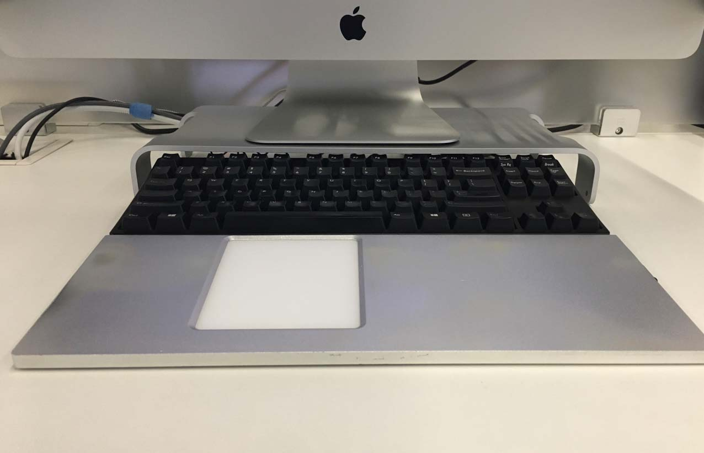

如图，是我的桌面. 

日常用 Filco 87 键盘搭配 Trackpad2, 实现类似 MacBook 的输入体验.

主要是避免将手从键盘移开.

本项目是手托设计的方案.

* 手托使用6063铝合金
* 可以通过磁盘吸附到键盘上
* 触摸板不会干扰打字
* 内置加热

## 部件

主要部件是手托和后盖. 以及一些小零件.

### 手托

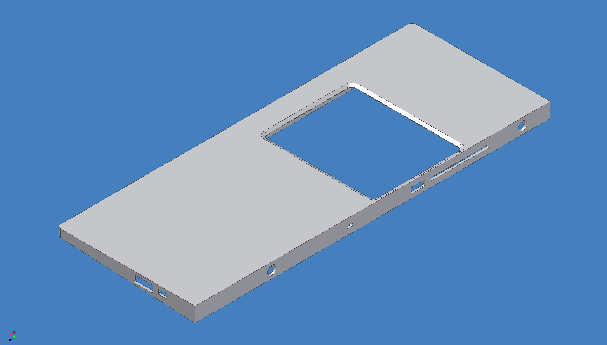

### 后盖

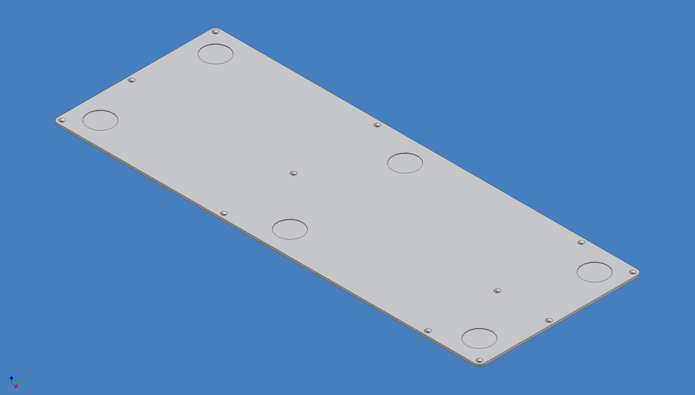

### 其他零件

* 3 + 3个自粘脚垫

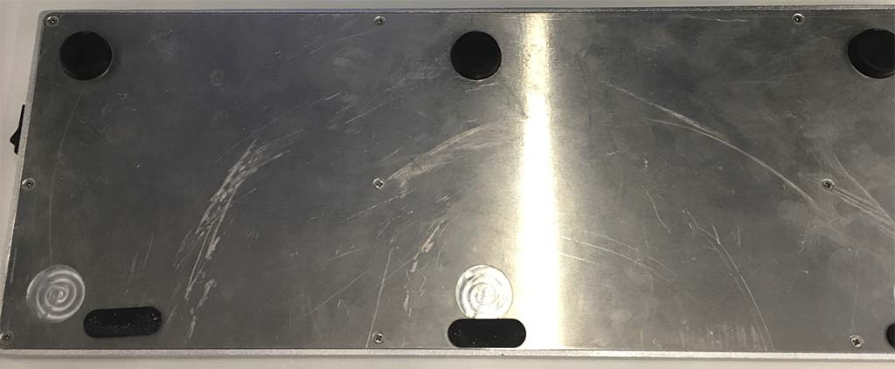

* 12 螺钉 - M2x6
* 透明胶带

可选 - 加热模块:

* 2 usb 加热板 - 100x80

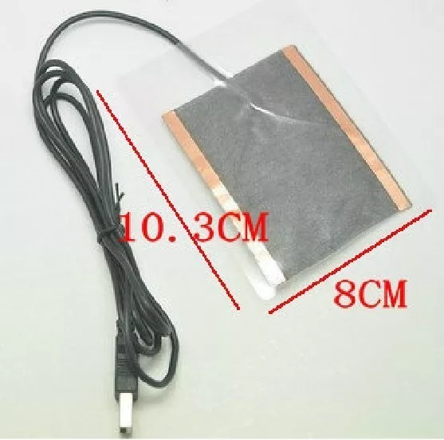

* 1 micro usb 底座

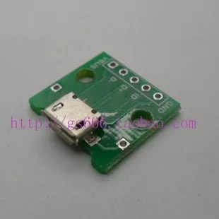

* 1 开关 - MR-2

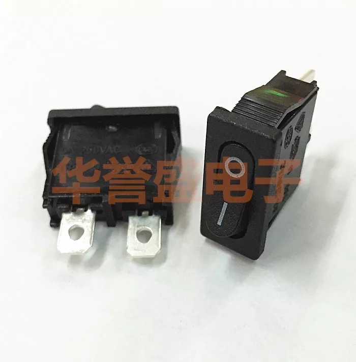

* 2 螺钉 - M2x4
* 一些电线

可选 - 吸附键盘:

* 2 磁铁 - 15x10x10

* 2 磁铁 - D10x3x4

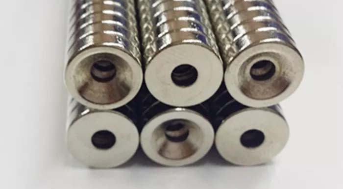

* 2 螺钉 - M4x8

## 制作手托和后盖

可以在网上找 CNC 加工的店铺, 并给他们 step 和 AutoCAD 文件.

或是把项目地址发给他们.

注意: `确保加工时, 对14个螺纹孔进行了攻丝, 否则安装不了螺钉.`

个性化:

* 定制你喜欢的阳极氧化颜色.
* 表面喷砂 (最少100目, 越高越细腻).
* 增加倒角的大小, 图纸中倒角为2.

## 组装

* 先清洁手托和后盖.
* 为了保护触摸板的玻璃表面, 在手托接触触摸板的地方, 粘贴一些透明胶.
* 安装开关和 usb 底座.
* 安装加热板.
* 用电线连接开关, usb 底座及加热板.

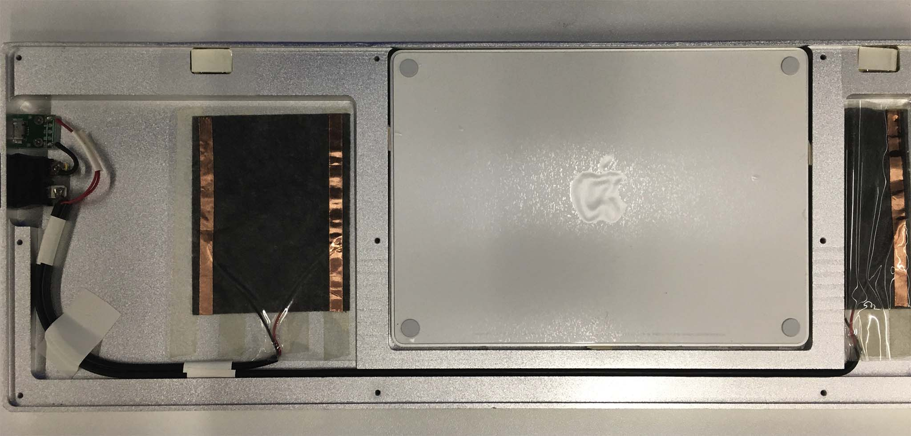

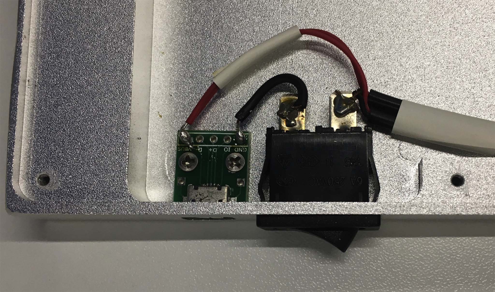

* 在手托中装入磁铁.
* 装好后盖，并用螺钉固定.
* 在后盖上粘贴好脚垫.
* 将磁铁安装到键盘上, 将手托吸附到键盘.

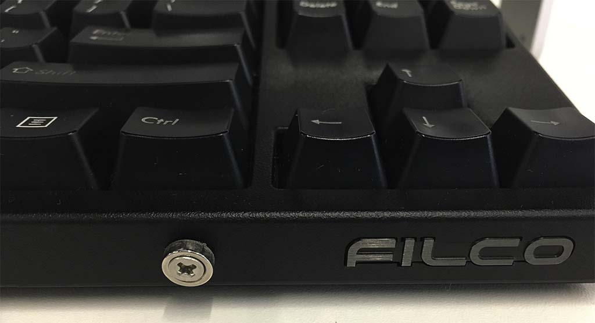

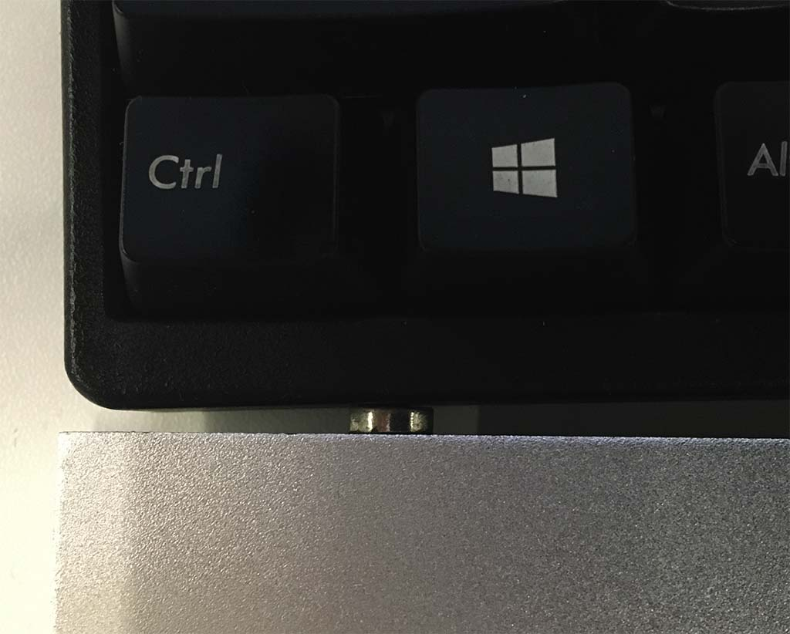

## 修改设计

设计文件是由 AutoCAD r14 和 Invertor r6 制作，用新版本的 AutoCAD 和 Invertor 应该可以打开.

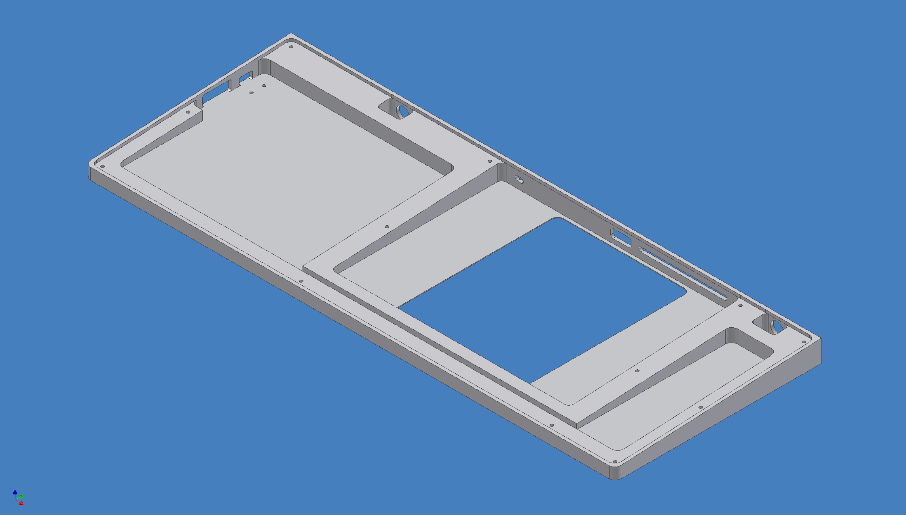

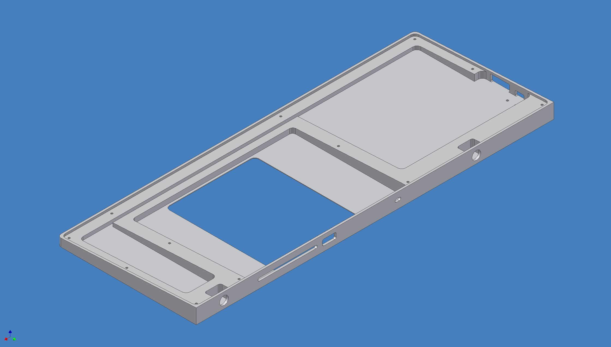

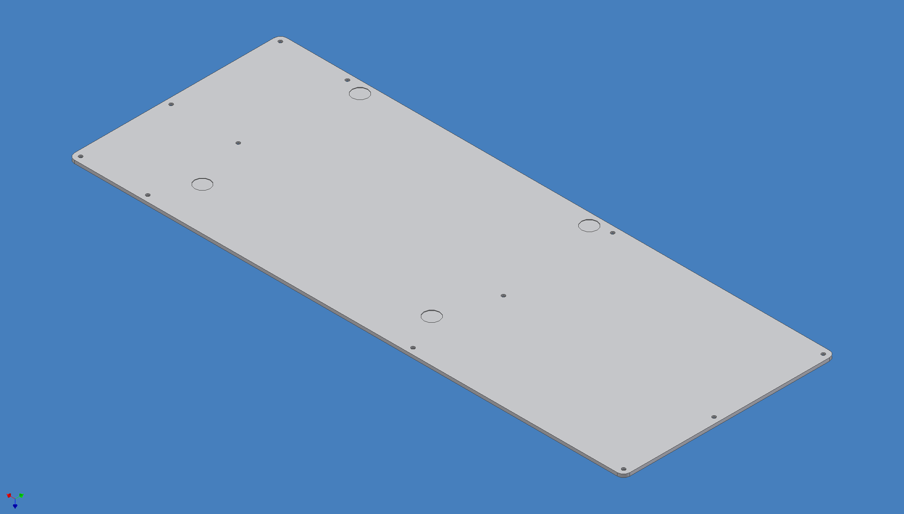

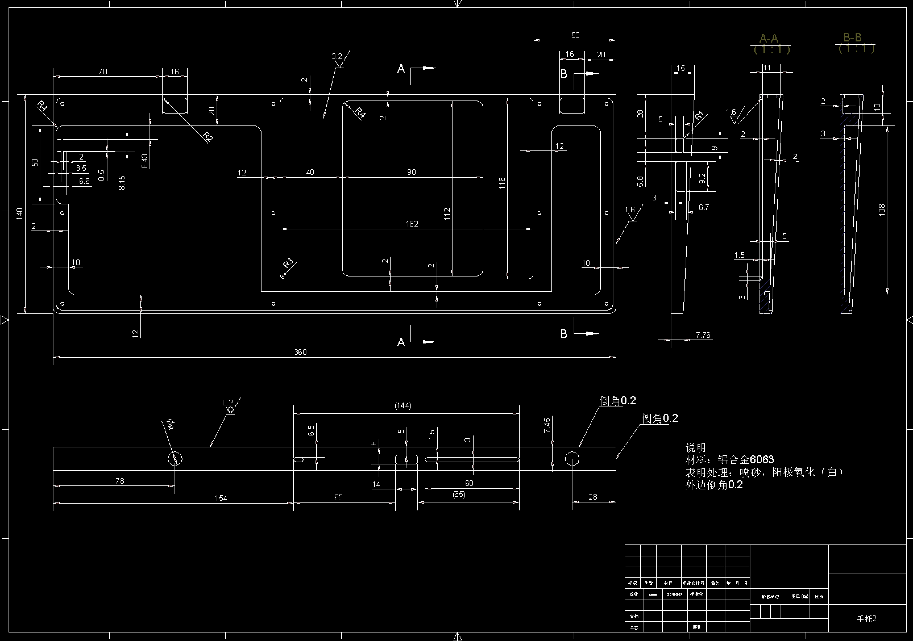

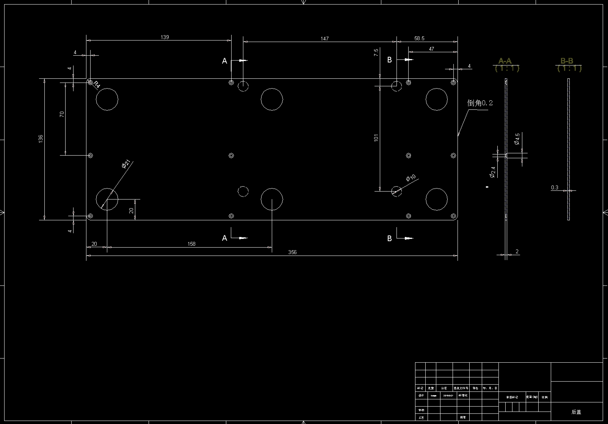

## Licence

CERN Open Hardware Licence v2
